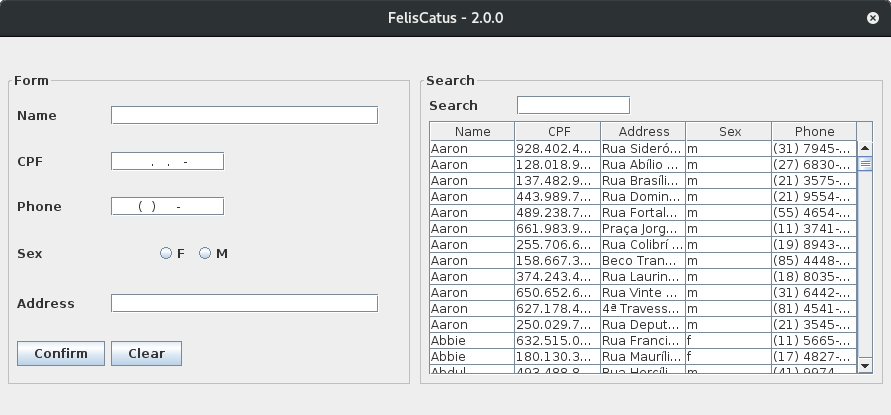

# Felis Catus

-----

CRUD simples utilizando Java Swing, JPA e PostgreSQL.

## How to build

Run the __`build.bat`__ file for _Windows_ or __`build.sh`__ for _Linux_, both are in the root directory of this project

> After execution, the file __`felis-catus.jar`__ will be generated in the directory `target`

## Objetivo

-----

Criar uma interface visual para cadastro, consulta, alteração e exclusão de dados de clientes

### Screenshot

----

