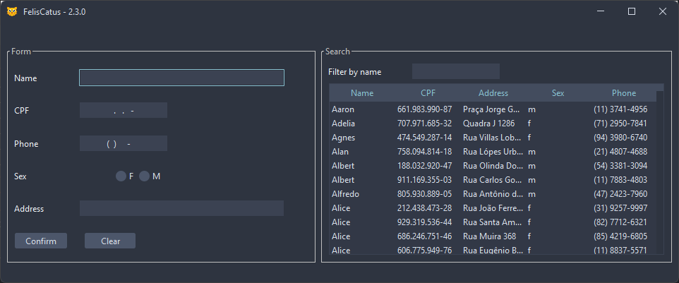

# Felis Catus

Simple User's CRUD using Java Swing and PostgreSQL as DB.

## How to build

Run the __`build.bat`__ file for _Windows_ or __`build.sh`__ for _Linux_, both are in the root directory of this project

> After execution, the file __`felis-catus.jar`__ will be generated in the directory `target`

## Goal

Create an example project with a visual interface for registering, querying, changing, and deleting user data

### Screenshot

----

